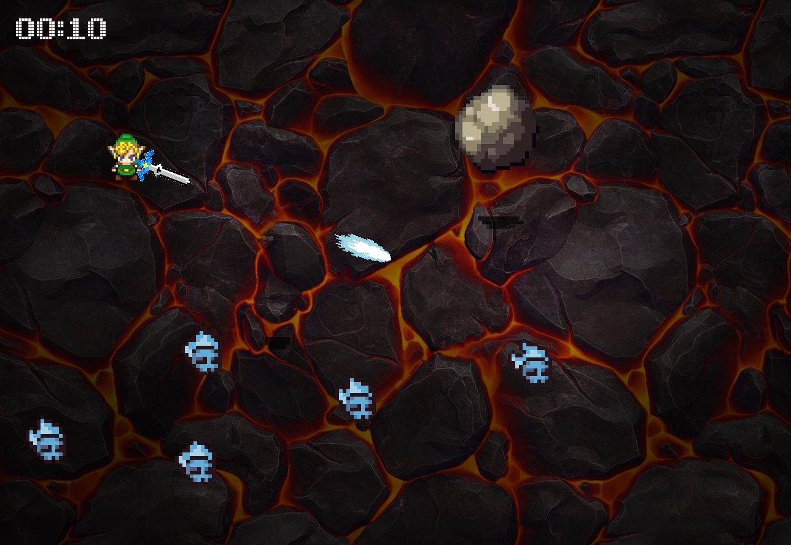

# IN204 - Reinforcement Learning dans un jeu vidéo en C++

## Le jeu
Vous contrôlez un joueur qui peut se déplacer suivant les quatres directions (HAUT, BAS, GAUCHE, DROITE). Avec votre souris vous pouvez diriger une épée et tirer pour tuer les ennemis bleus. Les roches qui tombent doivent être esquiver, on peut anticiper leur point d'impact grâce à leur ombre.<br />
Si un rocher ou un ennemi bleu vous touche, la partie se termine et la fenêtre de jeu se ferme.<br />
<br />
**Commandes** :
* Z : HAUT
* Q : GAUCHE
* S : BAS
* D : DROITE
* Clic gauche : Tir épée



## L'algorithme
Nous avons décidé d'implémenter l'algorithme PPO pour créer un agent qui apprend à jouer à notre jeu. Dans notre environnement, l'observation est une image RGB de l'écran de jeu de taille (1300, 800, 3). Les récompenses sont calculées ainsi : +1 pour chaque pas de temps où l'agent est en vie, -100 s'il touche un ennemi, +100 si l'agent réussi à survivre à un certain nombre de pas de temps. Chaque action est répété k fois, où k est un entier choisi de manière aléatoire entre 3 et 6. Notre but est de maximiser la récompense. <br />

## Optimisation de l'observation
L'étape d'optimisation des données est primordial pour améliorer la vitesse de l'apprentissage. L'ensemble des pixels n'est pas nécessaire pour la compréhension de l'environnement c'est pourquoi nous avons fait les modifications suivantes (basées sur https://deepanshut041.github.io/Reinforcement-Learning/cgames/02_space_invader/) :
* Mettre l'image en niveau de gris (la couleur apporte peu d'informations)
* Normaliser les valeurs des pixels (passage d'entiers allant de 0 à 255 en flottants allant de 0.0 à 1.0)
* Réduire la taille de l'image en 100x100 au lieu de 1300x800
* Empiler au moins 4 images pour avoir l'information de la vitesse et la direction des ennemis

## Compiler le projet sans l'IA
Le jeu seul se trouve sur la branche main. Après avoir cloné le projet, il faut se rendre sur cette branche.
```
git checkout main
```
Assurez-vous d'avoir cmake, make et OpenMP avant de continuer. 

**Installer les dépendances liées à SFML** <br />
```
sudo apt install libfreetype6-dev libxrandr-dev libudev-dev libogg-dev libflac-dev libvorbis-dev libopenal-dev libsfml-dev
```

**Ajouter SFML au projet** <br />
Nous utilisons l'environnement graphique fourni par SFML. Pour cela, rendez-vous dans le dossier IN204_projet_IA_game/ puis effectuez les commandes suivantes :
```
wget https://www.sfml-dev.org/files/SFML-2.5.1-sources.zip
unzip SFML-2.5.1-sources.zip
rm SFML-2.5.1-sources.zip
```
Un dossier SFML-2.5.1 s'est crée, il faut ensuite crée le makefile en utilisant cmake :
```
cd SFML-2.5.1
cmake -DCMAKE_INSTALL_PREFIX=~/path/to/the/project/IN204_projet_IA_game/SFML-2.5.1-Compiled
```
Il faut remplacer `~/path/to/the/project/IN204_projet_IA_game` par le chemin du projet puis ensuite :

```
make
make install
```

**Ajouter libtorch au projet** <br />
Il suffit de télécharger libtorch (version LTS 1.8.2). Retournez dans le dossier IN204_projet_IA_game/ puis faites les commandes suivantes :
```
wget https://download.pytorch.org/libtorch/lts/1.8/cpu/libtorch-cxx11-abi-shared-with-deps-1.8.2%2Bcpu.zip
unzip libtorch-cxx11-abi-shared-with-deps-1.8.2%2Bcpu.zip
```
**Création du makefile pour compiler le projet** <br />
Allez dans le dossier IN204_projet_IA_game/Sources/ puis créer un fichier `CMakeLists.txt` qui contiendra :
```
cmake_minimum_required(VERSION 3.16)
project(game-app)

set(CMAKE_CXX_STANDARD 17)

set(SFML_INCLUDE_DIR "${CMAKE_BINARY_DIR}/../SFML-2.5.1-Compiled/include")
set(SFML_LIBRARY_DIR "${CMAKE_BINARY_DIR}/../SFML-2.5.1-Compiled/lib")
set(SFML_DIR "${CMAKE_BINARY_DIR}/../SFML-2.5.1-Compiled/lib/cmake/SFML")
set(Torch_DIR "/absolute/path/to/project/IN204_projet_IA_game/libtorch/share/cmake/Torch")

link_directories(SFML_LIBRARY_DIR)
include_directories(SFML_INCLUDE_DIR)

find_package(SFML 2.5.1 COMPONENTS system window graphics network audio)
find_package(Torch REQUIRED)
find_package(OpenMP)

if (OPENMP_FOUND)
    set (CMAKE_C_FLAGS "${CMAKE_C_FLAGS} ${OpenMP_C_FLAGS}")
    set (CMAKE_CXX_FLAGS "${CMAKE_CXX_FLAGS} ${OpenMP_CXX_FLAGS}")
    set (CMAKE_EXE_LINKER_FLAGS "${CMAKE_EXE_LINKER_FLAGS} ${OpenMP_EXE_LINKER_FLAGS}")
endif()

if(SFML_FOUND)
    message(STATUS "SFML_INCLUDE_DIR: ${SFML_INCLUDE_DIR}")
    message(STATUS "SFML_LIBRARIES: ${SFML_LIBRARIES}")
    message(STATUS "SFML_VERSION: ${SFML_VERSION}")
endif()

add_executable(game-app Enemy.cpp EnemyRock.cpp Fireball.cpp Game.cpp main.cpp Player.cpp ppo_torch.cpp ./create_plot/pbPlots.cpp ./create_plot/supportLib.cpp)
target_link_libraries (game-app "${TORCH_LIBRARIES}" sfml-graphics)
```
Veillez à remplacer le chemin `/absolute/path/to/project/IN204_projet_IA_game` (ligne 9) par le chemin **absolu** du projet. <br />
Ensuite, pour compiler le projet il suffit de créer un dossier `build` au niveau du fichier `CMakeLists.txt` et de compiler le `CMakeLists.txt` :
```
mkdir build
cd build
cmake -DCMAKE_PREFIX_PATH=/absolute/path/to/libtorch ..
cmake ..
make
```
Veillez à remplacer `/absolute/path/to/libtorch` par le chemin **absolu** vers le dossier libtorch qui se trouve dans le dossier IN204_projet_IA_game/.
Après cela, l'exécutable `game-app` a été crée dans le dossier build et vous pouvez commencer à jouer !
```
./game-app
```

## Compiler le jeu avec l'IA
Le jeu avec l'IA se trouve sur la branche IA `git checkout IA`, il suffit d'aller dans le dossier IN204_projet_IA_game/Sources/build et de faire :

```
cmake ..
make
```

Pour lancer l'entraînement, il suffit d'ouvrir l'exécutable `./game-app`. <br />
**Il se peut que le programme s'interrompt car il ne trouve pas les fichiers critic_torch_ppo.pt et actor_torch_ppo.pt. Il faut les créer dans le dossier IN204_projet_IA_game/Sources/tmp/ppo avec les commandes `touch critic_torch_ppo.pt` et `touch actor_torch_ppo.pt`**

